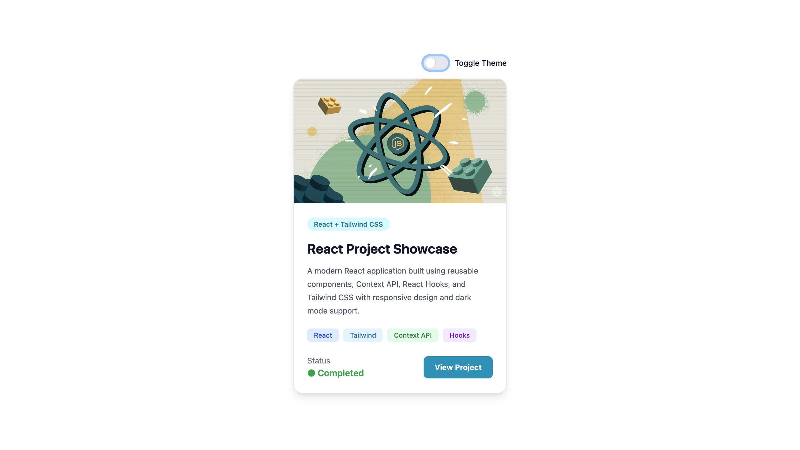
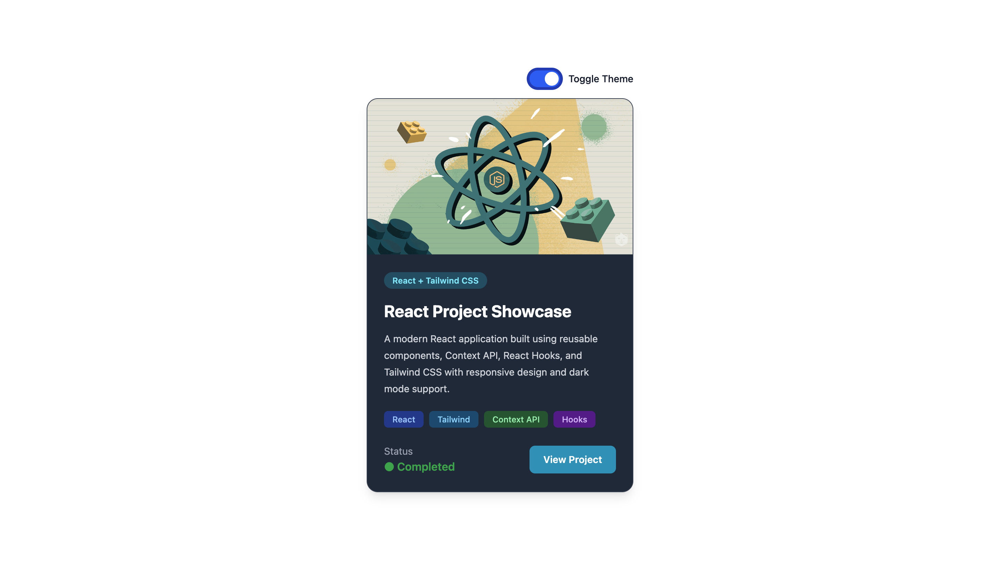

# ⚛️ React Theme Switcher

A modern React project built while learning **React Context API**, **Custom Hooks**, and **Tailwind CSS v4**. This project demonstrates global state management using the Context API and includes a fully functional Light/Dark Theme Switcher with a responsive project showcase card.

---

## 🚀 Features

- 🌗 Light & Dark Theme Toggle
- ⚛️ React Context API for global state management
- 🪝 Custom Hook (`useTheme`)
- 🎨 Tailwind CSS v4
- 📱 Fully Responsive Design
- ✨ Smooth Hover Animations
- 🧩 Reusable Components
- ⚡ Built with Vite

---

## 🛠️ Tech Stack

- React
- Vite
- Context API
- Custom Hooks
- Tailwind CSS v4
- JavaScript (ES6+)

---

## 📂 Project Structure

```
src/
│
├── components/
│   ├── Card.jsx
│   └── ThemeBtn.jsx
│
├── contexts/
│   └── theme.js
│
├── App.jsx
├── main.jsx
└── index.css
```

---

## 🧠 Concepts Covered

- React Components
- JSX
- Props
- useState
- useEffect
- Context API
- createContext()
- useContext()
- Custom Hooks
- Global State Management
- Tailwind CSS v4
- Dark Mode

---

## 📦 Installation

Clone the repository

```bash
git clone https://github.com/your-username/React-learn-code.git
```

Go to the project directory

```bash
cd project6
```

Install dependencies

```bash
npm install
```

Start the development server

```bash
npm run dev
```

---

## 🎯 How It Works

1. The application creates a global Theme Context.
2. The current theme is stored using `useState`.
3. The Context Provider shares the theme across all components.
4. The custom hook `useTheme()` allows any component to access or update the theme.
5. Clicking the toggle button switches between Light and Dark mode.

---

## 📸 Project Highlights

- Clean UI
- Responsive Layout
- Reusable Components
- Context API Implementation
- Custom Hook Pattern
- Modern Tailwind CSS Styling

---

## 📸 Preview

### ☀️ Light Mode



### 🌙 Dark Mode



---

## 🌟 Future Improvements

- Theme Persistence using Local Storage
- Multiple Theme Colors
- Framer Motion Animations
- React Router Integration
- Project Gallery
- Backend Integration

---

## 👨‍💻 Author

**Priyanshu Singh**

GitHub: https://github.com/priyanshusingh280906-hub

---

## 📄 License

This project is open-source and available under the **MIT License**.

---

### ⭐ If you like this project, consider giving it a star!