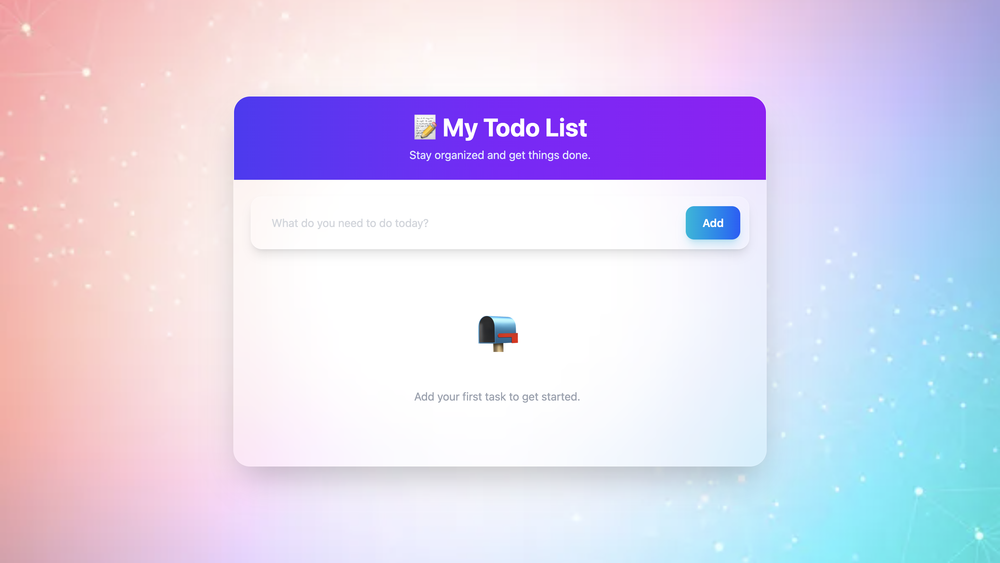

# 📝 Modern Todo App

A beautiful and responsive **Todo Application** built with **React**, **Vite**, **Tailwind CSS**, and **Context API**. This project demonstrates modern React concepts such as Context API, custom hooks, local storage, and CRUD operations while featuring a clean glassmorphism-inspired UI.

---

## ✨ Features

- ➕ Add new todos
- ✏️ Edit existing todos
- ✅ Mark todos as completed
- 🗑️ Delete todos
- 💾 Automatic Local Storage persistence
- 🌌 Modern Glassmorphism UI
- 🖼️ Custom background image support
- 📱 Fully Responsive Design
- ⚡ Built with Vite for fast development

---

## 🛠️ Tech Stack

- React
- Vite
- Context API
- Tailwind CSS v4
- JavaScript (ES6+)
- Local Storage

---

## 📂 Project Structure

```
Todo-App/
│
├── public/
│
├── src/
│   ├── assets/
│   │   └── background.jpg
│   │
│   ├── components/
│   │   ├── TodoForm.jsx
│   │   └── TodoItem.jsx
│   │
│   ├── contexts/
│   │   └── TodoContext.jsx
│   │
│   ├── App.jsx
│   ├── main.jsx
│   └── index.css
│
├── package.json
├── vite.config.js
└── README.md
```

---

## 🚀 Getting Started

### 1️⃣ Clone the Repository

```bash
git clone https://github.com/your-username/React-learn-code.git
```

---

### 2️⃣ Navigate into the Project

```bash
cd project7
```

---

### 3️⃣ Install Dependencies

```bash
npm install
```

---

### 4️⃣ Start the Development Server

```bash
npm run dev
```

---

### 5️⃣ Open in Browser

```
http://localhost:5173
```

---

## 📚 React Concepts Practiced

- Functional Components
- useState
- useEffect
- Context API
- Custom Hooks
- Props
- Event Handling
- Conditional Rendering
- CRUD Operations
- Local Storage
- Controlled Components

---

## 🎯 How It Works

- Users can create new tasks.
- Todos are stored in React state.
- Every update is automatically saved to Local Storage.
- Reloading the page restores all previously saved todos.
- Users can edit, complete, or delete tasks at any time.

---

## 📸 Preview



---

## 🌟 Future Improvements

- 🔍 Search Todos
- 📂 Filter (All / Active / Completed)
- 🌙 Dark & Light Theme Toggle
- 🗓️ Due Dates
- ⭐ Priority Levels
- 📌 Drag & Drop Sorting
- 🔔 Notifications
- 📊 Todo Statistics
- ☁️ Firebase Backend
- 👤 User Authentication

---

## 📖 Learning Outcomes

This project helped reinforce understanding of:

- State Management using Context API
- Custom React Hooks
- React Component Architecture
- Persistent Storage using Local Storage
- Modern UI Design with Tailwind CSS
- Responsive Layout Design

---

## 🤝 Contributing

Contributions, issues, and feature requests are welcome!

Feel free to fork the repository and submit a pull request.

---

## 👨‍💻 Author

**Priyanshu Singh**

GitHub: https://github.com/priyanshusingh280906-hub

---

## ⭐ Support

If you found this project helpful, consider giving it a ⭐ on GitHub.

---

## 📜 License

This project is licensed under the **MIT License**.

---

### Made with ❤️ using React + Vite + Tailwind CSS